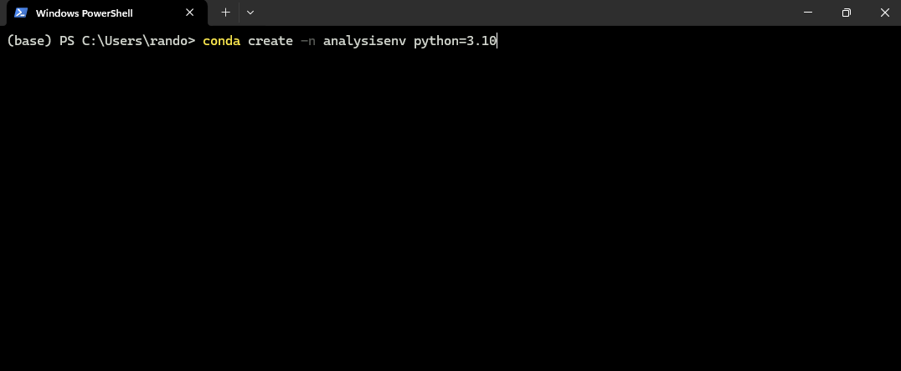
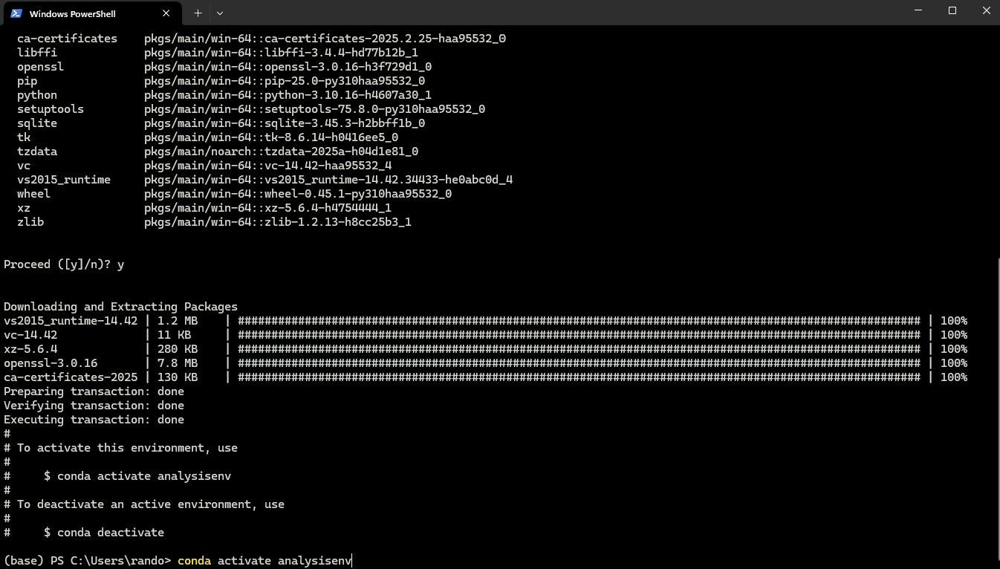
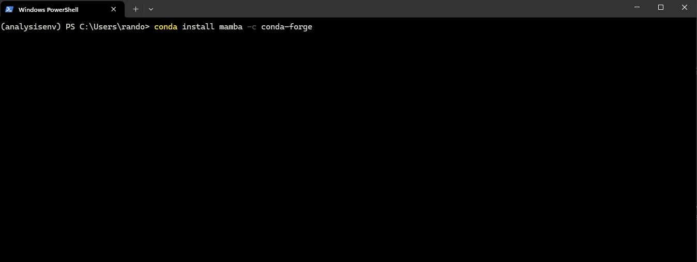
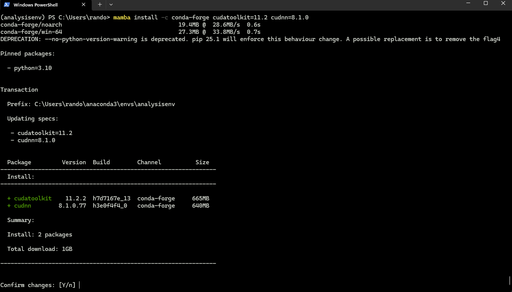
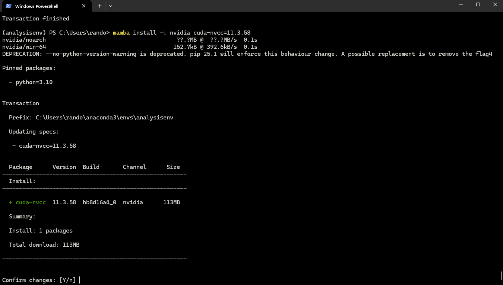

## Anaconda

Download Anaconda package for your OS, the instructions below are tailored ofr Windows OS users but can be also used if you have Mac or Linux. Once you have installed the conda environment, you can open an Anconda prompt or a Windows powershell promt. If your conda instalaation was done systemwide on your computer you should see your prompt in the terminal having (base) before the command line. 

## Creating a virtual environment

For this project you need to create a conda environment that will contain all the neccesary packages in your environment. in your terminal type the following to create a new environment (if you already have a virtualenv that you will be using for this porject you can skip this step)

As shown in the terminal windown below type the following command 
```sh
conda create -n analysisenv python=3.10
```




After pressing enter you should see an output as seen below


After this the basic packages start downloading and you can activate your environment by typing 

```sh
conda activate analysisenv
```




## Installing Mamba

Mamba is a more advanced package manager and it is a good idea to have it installed in your environment as well to aid in managing package dependencies.

```sh
conda install mamba -c conda-forge
```





## Main packages 

Once you have reached this step you are now ready to install the main packages that would be required to run your analysis pythin scripts and notebooks provided by us, to get them type the following

```sh
pip install caped-ai, ultralytics
```


This will install many packages in your environment and your screen should look as below


## Installing Cudatoolkit

Even though your HPC may have system level cuda toolkits that can be activated we can at the same time have those libraries in the environment itself

```sh
mamba install -c conda-forge cudatoolkit=11.2 cudnn=8.1.0
```




After this run 

```sh
mamba install -c nvidia cuda-nvcc=11.3.58
```




Now we come to a very important step, to cap the version of tensorflow we will be dealing with, since our models have been trained in Tensorflow 2.0 we have to cap the versions of Tensorflow and Keras, if by mistake you download a package that ups the version of these libraries, no worries, just run the command below in your environment and get the correct versions of these libraries

```sh
python3 -m pip install tensorflow-gpu==2.10.*
pip uninstall numpy
pip install numpy==1.26.4
```

We have additionally caped the version of numpy to be less than 2.0 to avoid breaking changes in our environment.

## Sucessful installtion

If you have followed all these steps, and if they worked or if you were prompted to update your pip and you did and then these steps worked give it a quick check by typing the following in your terminal

```sh
python
```
After this line you will be dropped from your terminal into a python shell, now in a single line type in

```sh
import vollseg, oneat, csbdeep, numpy, tensorflow, torch, lightning, ultralytics
```

The output of your screen should look as below


If you see the output as seen here, Congratulations you are now enabled to run all our codes, scripts, notebooks, Napari plugins on your computer/HPC. To exit the python shell type 

```sh
quit()
```

