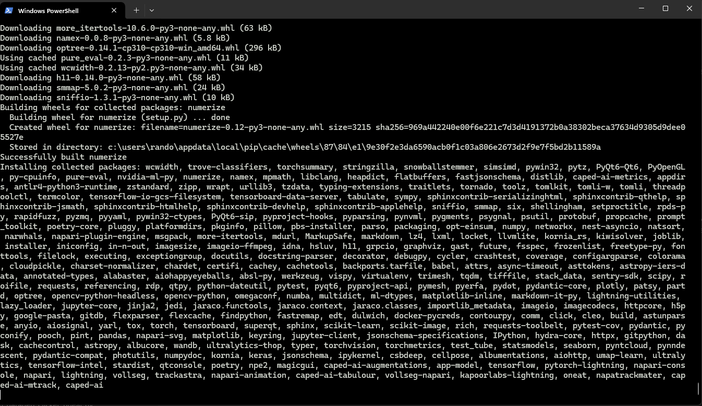
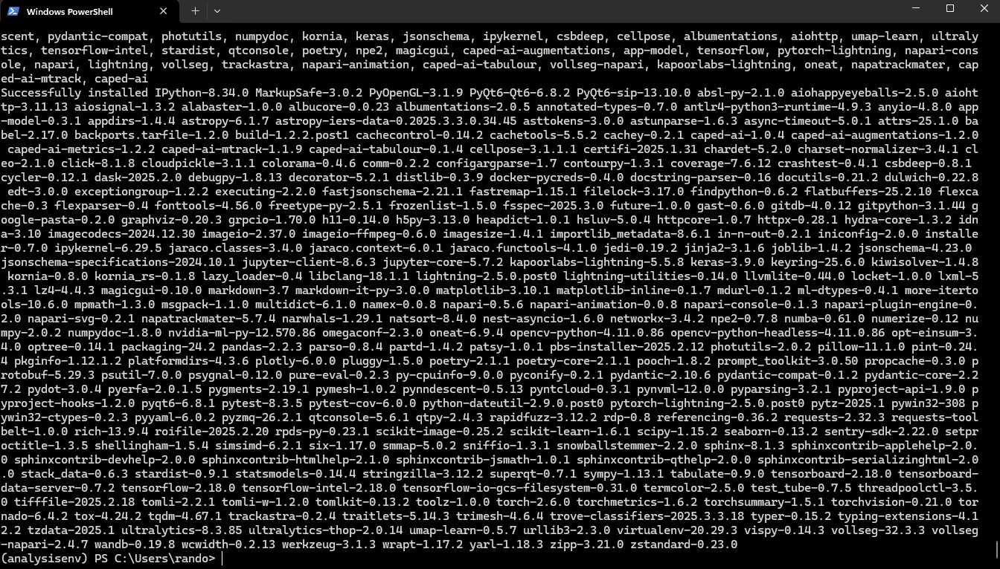

"""## 🐍 Creating a Virtual Environment

Download the Anaconda package for your OS. The instructions below are tailored for Windows users but can also be applied on Mac or Linux. Once Anaconda is installed, open an Anaconda Prompt or a Windows PowerShell. If the installation was system-wide, you should see `(base)` before your command prompt.

To create a new conda environment (skip this step if you already have one for this project):

```bash
conda create -n analysisenv python=3.10
```


After pressing Enter, you should see output similar to:


Activate your new environment:

```bash
conda activate analysisenv
```


---

## 🛠️ Installing Mamba

Mamba is a fast package manager that helps resolve dependencies efficiently. Install it into your environment:

```bash
conda install mamba -c conda-forge
```


---

## 📦 Installing Main Packages

Install the core packages required for analysis:

```bash
pip install caped-ai ultralytics
```


Wait for the installation to complete:




---

## 🚀 Installing CUDA Toolkit

Even if your HPC has system-wide CUDA, it's recommended to include it in your environment:

```bash
mamba install -c conda-forge cudatoolkit=11.2 cudnn=8.1.0
```


Then install the NVIDIA compiler:

```bash
mamba install -c nvidia cuda-nvcc=11.3.58
```


---

## 🔒 Locking TensorFlow & NumPy Versions

To ensure compatibility with our models (trained on TensorFlow 2.x):

```bash
python3 -m pip install tensorflow-gpu==2.10.*
pip uninstall numpy
pip install numpy==1.26.4
```

---

## ✅ Successful Installation

Verify everything by entering a Python REPL:

```bash
python
```

Then run:

```python
import vollseg, oneat, csbdeep, numpy, tensorflow, torch, lightning, ultralytics
```

You should see no errors, similar to:


Exit the shell:

```bash
quit()
```

Congratulations! Your environment is now ready to run all our scripts, notebooks, and Napari plugins.
"""