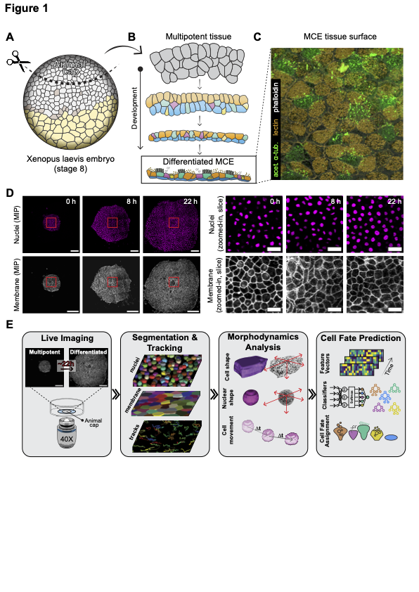

📘 CopenhagenWorkflow

> Single-cell morphodynamics predicts cell fate decisions during Xenopus mucociliary differentiation.


[](https://github.com/kapoorlab/CopenhagenWorkflow/blob/main/LICENCE)

[Website](https://kapoorlab.github.io/CopenhagenWorkflow/README.html)
---

## 🌐 Code

**Authors:** Mari Tolonen, Ziwei Xu, Ozgur Beker, Varun Kapoor, Bianca Dumitrascu, Jakub Sedzinski  
 
📁 [**GitHub Repository**](https://github.com/kapoorlab/CopenhagenWorkflow)

---



## 🚀 Installation (Quickstart)

```bash
conda create -n capedenv python=3.10
conda activate capedenv
conda install mamba -c conda-forge
pip install caped-ai ultralytics napari_fast4dreg
mamba install -c conda-forge cudatoolkit=11.2 cudnn=8.1.0
mamba install -c nvidia cuda-nvcc=11.3.58
pip install tensorflow-gpu==2.10.*
pip uninstall numpy && pip install numpy==1.26.4
```

This workflow uses Hydra to manage parameters, paths, and models in a clean, modular fashion.

📁 **Configuration Structure**

```bash
conf/
├── experiment_data_paths/
│   └── <dataset>.yaml
├── model_paths/
│   └── <model_config>.yaml
└── parameters/
    └── <stage_config>.yaml
```

🔬 **Pipeline Overview**

Each step of the pipeline is a standalone script with its own configuration:
- `00_create_nuclei_membrane_splits.py` – generate `Merged.tif` and split channels  
- `01_nuclei_segmentation.py` – StarDist 3D nuclear segmentation  
- `01_enhance_membrane.py` – CARE denoising for membrane channel  
- `01_vollcellpose_membrane_segmentation.py` – Cellpose 2D membrane segmentation and 3D reconstruction  
- `02_oneat_nuclei.py` – mitosis classification using Oneat  
- `03_nms_nuclei_automated.py` – non-max suppression (automated)  
- `03_nms_nuclei_interactive.py` – non-max suppression (interactive via Napari)  

All parameters are controlled via YAML files in the `conf/` directory.

---

## 🧩 Features

- 📊 Tracking with TrackMate 7 + Oneat integration  
- 🧠 DenseNet mitosis classification  
- 🧬 Full 3D segmentation and lineage reconstruction  
- 🪄 Napari plugins for manual inspection and correction  
- 🧰 Evaluation via Jaccard, F1, and Cell Tracking Challenge metrics  

---

## 🙌 Acknowledgments

This project builds on the work of many excellent tools, including:
- StarDist  
- CARE (CSBDeep)  
- Cellpose  
- TrackMate  
- Hydra  
- Napari  

---

## 🤝 Contributing

We welcome issues, pull requests, and external extensions.  
Feel free to fork and open a PR with improvements or new modules.

---

## 🔗 License

MIT License
